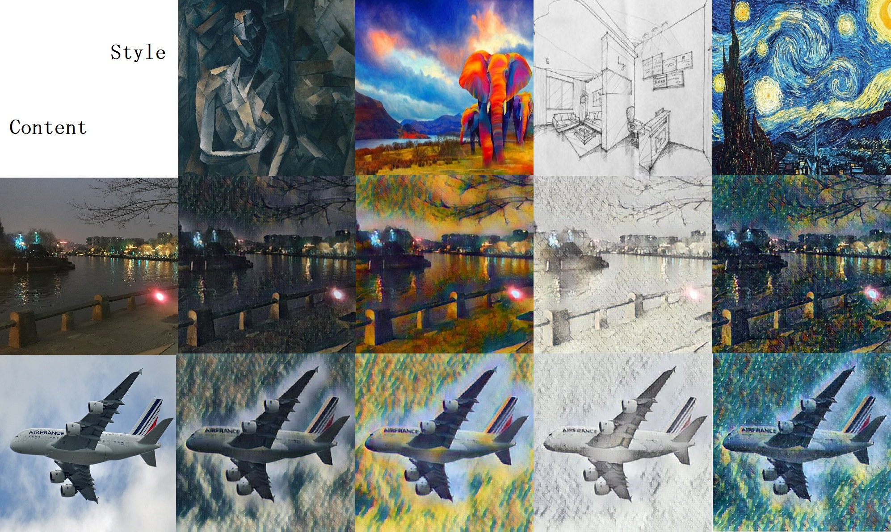

# 风格迁移keras版本


和前面的torch版思路一样，我这里为了优化速度以及模型，做了一些细节改动。可以对比参考。
keras版本的模型权重大约在200MB左右，在单1080TI卡训练时间12-24h。

已经训练好的权重文件：链接: https://pan.baidu.com/s/15B77PssGS4hBRsj7i3NRKw 密码: kmh8

最终效果如图所示：



## Metanet

除了vgg外自己做了一个简易的cnn捕捉特征。另外将style的输出提取了一部分公共hidden，增强鲁棒性的同时还减小了模型大小。
输出时使用了0.0001的因子，为了控制kernel和bias参数不至于震荡。


```py
    meta_input1 = concatenate([Mean_std()(l) for l in style_feature_model(Lambda(lambda x: vgg_pre(x))(input2))])
    x = Lambda(lambda x: 1/15 * x)(input2)
    x = ConvLayer(64, kernel_size=9, stride=1, trainable=True)(x)
    x = ConvLayer(64, kernel_size=3, stride=2, trainable=True)(x)
    x = ConvLayer(256, kernel_size=3, stride=2, trainable=True)(x)
    meta_input2 = Mean_std()(x)
    meta_output_list = []
    hidden = concatenate([Dense(128, activation='relu')(meta_input1), Dense(16, activation='sigmoid')(meta_input2),
                          Dense(128, activation='relu')(meta_input2)])
    hidden = Dropout(0.05)(hidden)
    for name,shape in parms.params_dict:
        hidden2 = concatenate([Dense(64,activation = 'relu')(meta_input1),Dense(32,activation = 'sigmoid')(meta_input2),Dense(16,activation = 'relu')(meta_input2)])
        hidden2 = concatenate([Dropout(0.1)(hidden2), hidden])
        kernel = Dense(np.prod(shape[0]),activation = 'linear')(hidden2)
        bias = Dense(shape[1],activation = 'linear')(hidden2)
        meta_output_list.append(Lambda(lambda x:0.0001*x)(kernel))
        meta_output_list.append(Lambda(lambda x:0.0001*x)(bias))
    meta_output = (concatenate(meta_output_list))
    meta_model = Model(input2,meta_output)
```

## Transformnet

因为keras的vgg19并没有将input归一化除255，所以我这里权衡了归一及不归一的方案，折衷使用了15的scaler。
在upsample和downsample过程并没有大量使用metanet控制conv权值，因为这部分更多是进行sample，个人认为风格化的主要过程发生在residual部分。


## 端到端的训练

端到端的网络将Conv2D中的权重改为了metanet的输入，这里使用了我自定义的Conv：

```py
    def call(self, inputs):
        weight_start,weight_shape = self.shape
        kernel = K.reshape(inputs[1][:, weight_start:weight_start + np.prod(weight_shape[0])], (-1,) + weight_shape[0])
        bias = K.reshape(inputs[1][:,
                       weight_start + np.prod(weight_shape[0]):weight_start + np.prod(weight_shape[0]) + weight_shape[
                           1]]
                       , (-1,weight_shape[1]))
        kernel = kernel[0,:,:,:,:]
        bias = bias[0,:]
        outputs = K.conv2d(
                inputs[0],
                kernel,
                strides=self.strides,
                padding=self.padding,
                data_format=self.data_format,
                dilation_rate=self.dilation_rate)

        if self.use_bias:
            outputs = K.bias_add(
                outputs,
                bias,
                data_format=self.data_format)

        if self.activation is not None:
            return self.activation(outputs)
        return outputs
```

放弃了论文中的单风格图片训练以及切换风格图片的方式，而是使用端到端的方式。在训练初期保留单风格的方式训练，而到训练了30种风格以后切换成4-8张风格图片shuffle+batch输入，加快收敛速度。

## 梯度控制optimizers

升级版的adagrad，可以对某些特定layer（metanet）进行梯度控制，否则无法收敛。

```py
class Adagrad2(Adagrad):
    def __init__(self, norm_val=[], clipvalue2 = 10.0, **kwargs):
        super(Adagrad2, self).__init__(**kwargs)
        self.norm_val = norm_val
        self.clipvalue2 = clipvalue2

    def get_gradients(self, loss, params):
        grads = K.gradients(loss, params)
        if hasattr(self, 'clipnorm') and self.clipnorm > 0:
            norm = K.sqrt(sum([K.sum(K.square(g)) for g in grads]))
            grads = [clip_norm(g, self.clipnorm, norm) if x in self.norm_val else g for x,g in zip(params,grads)]
        if hasattr(self, 'clipvalue') and self.clipvalue > 0:
            grads = [K.clip(g, -self.clipvalue, self.clipvalue) if x in self.norm_val else K.clip(g, -self.clipvalue2, self.clipvalue2) for x,g in zip(params,grads)]
        return grads
```


